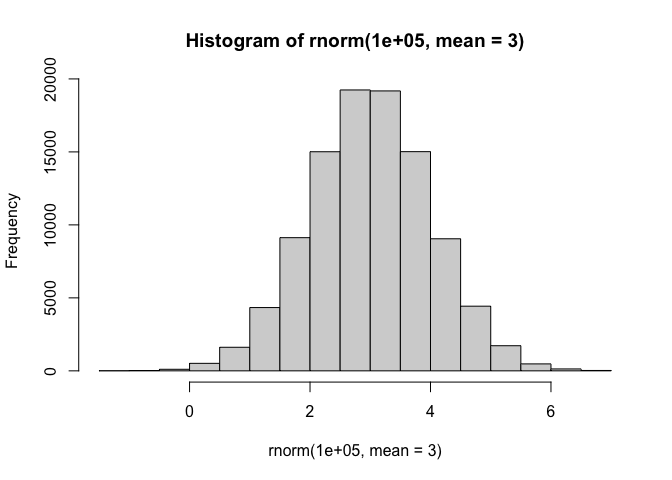
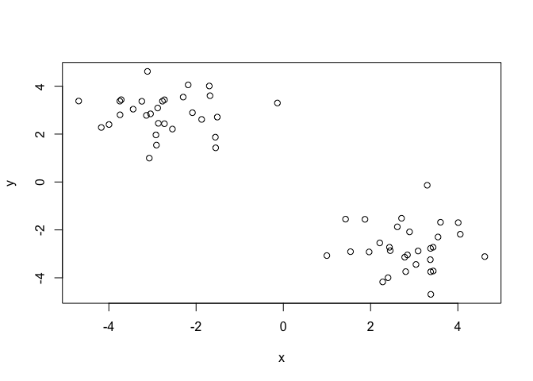
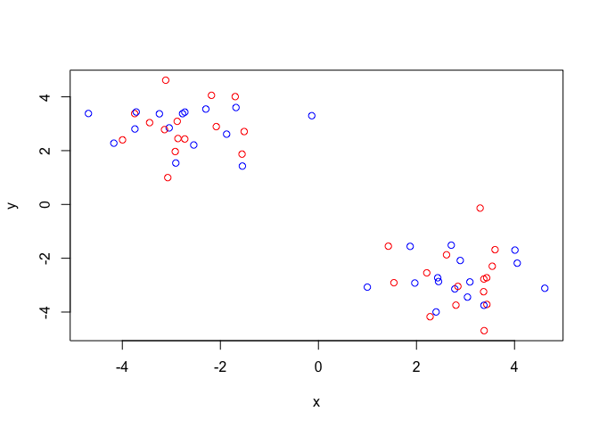
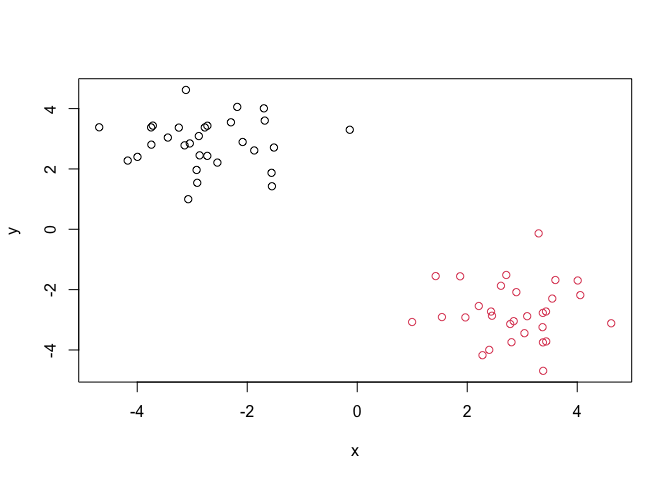
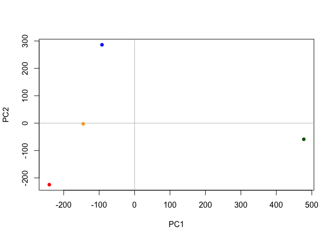

# Class 7: Machine learning 1
McKenzie Mai (A16646664)

Today we will start our multi-part exploration of some key machine
learning methods. We will begin with clustering- finding groupings in
data, and then dimensionallity reduction.

## Clustering

Let’s start with “k-means” clustering. The main function in base R for
this `kmeans()`

``` r
# Make up some data
hist( rnorm(100000, mean=3) )
```



``` r
tmp <- c(rnorm(30, -3), rnorm(30, +3))
x <- cbind(x= tmp, y=rev(tmp))
plot(x)
```



Now let’s try out `kmeans()`

``` r
km <- kmeans(x, centers=2)
km
```

    K-means clustering with 2 clusters of sizes 30, 30

    Cluster means:
              x         y
    1  2.861399 -2.734753
    2 -2.734753  2.861399

    Clustering vector:
     [1] 2 2 2 2 2 2 2 2 2 2 2 2 2 2 2 2 2 2 2 2 2 2 2 2 2 2 2 2 2 2 1 1 1 1 1 1 1 1
    [39] 1 1 1 1 1 1 1 1 1 1 1 1 1 1 1 1 1 1 1 1 1 1

    Within cluster sum of squares by cluster:
    [1] 46.11617 46.11617
     (between_SS / total_SS =  91.1 %)

    Available components:

    [1] "cluster"      "centers"      "totss"        "withinss"     "tot.withinss"
    [6] "betweenss"    "size"         "iter"         "ifault"      

``` r
attributes(km)
```

    $names
    [1] "cluster"      "centers"      "totss"        "withinss"     "tot.withinss"
    [6] "betweenss"    "size"         "iter"         "ifault"      

    $class
    [1] "kmeans"

> Q. How many popints in each cluster?

``` r
km$size
```

    [1] 30 30

> Q. What component of your result object details cluster
> assignment/membership?

``` r
km$cluster
```

     [1] 2 2 2 2 2 2 2 2 2 2 2 2 2 2 2 2 2 2 2 2 2 2 2 2 2 2 2 2 2 2 1 1 1 1 1 1 1 1
    [39] 1 1 1 1 1 1 1 1 1 1 1 1 1 1 1 1 1 1 1 1 1 1

> Q. What are centers/mean values of each cluster?

``` r
km$centers
```

              x         y
    1  2.861399 -2.734753
    2 -2.734753  2.861399

> Q. Make a plot of your data showing your clustering results
> (groupings/clusters and cluster centers).

``` r
plot(x, col=c("red", "blue"))
```



``` r
c(1:5) + c(100,1)
```

    Warning in c(1:5) + c(100, 1): longer object length is not a multiple of
    shorter object length

    [1] 101   3 103   5 105

``` r
plot(x, col=c(1,2))
```


``` r
plot(x, col=km$cluster)
points(km$centers, col="green", pch=15, cex=3)
```


> Q. Run `kmeans()` agan and cluster in 4 groups and plot the results.

``` r
km4 <- kmeans(x, centers = 4)
plot(x, col=km4$cluster)
```


## Hierarchical Clustering

This form of clustering aims to reveal the structure in your data by
progressively grouping points into an even smaller number of clusters.

The main function in base R for this called `hclust()`. This function
does not take our input data directly but wants a “distance matrix” that
details how (dis)similar all our input points are to each other.

``` r
hc <- hclust(dist(x))
hc
```


    Call:
    hclust(d = dist(x))

    Cluster method   : complete 
    Distance         : euclidean 
    Number of objects: 60 

The print out above is not very useful (unlike that from kmeans) but
there is a useful `plot()` method.

``` r
plot(hc)
abline(h=10, col="red")
```


To get my main result (my cluster membership vector) I need to “cut” my
tree using the function `cutree()`

``` r
grps <- cutree(hc, h=10)
grps
```

     [1] 1 1 1 1 1 1 1 1 1 1 1 1 1 1 1 1 1 1 1 1 1 1 1 1 1 1 1 1 1 1 2 2 2 2 2 2 2 2
    [39] 2 2 2 2 2 2 2 2 2 2 2 2 2 2 2 2 2 2 2 2 2 2

``` r
plot(x, col=grps)
```



``` r
plot(x, col=cutree(hc, h=6))
```


# Principal Component Analysis (PCA)

The goal of PCA is to reduce the dimensionality of a dataset down to
some smaller subset of new variables (called PCs) that are a useful
bases for further analysis, like visualization, clustering, etc.

## Data import

Read data about crazy eating trends in the UK and N. Ireland

``` r
url <- "https://tinyurl.com/UK-foods"
x <- read.csv(url, row.names=1)
x
```

                        England Wales Scotland N.Ireland
    Cheese                  105   103      103        66
    Carcass_meat            245   227      242       267
    Other_meat              685   803      750       586
    Fish                    147   160      122        93
    Fats_and_oils           193   235      184       209
    Sugars                  156   175      147       139
    Fresh_potatoes          720   874      566      1033
    Fresh_Veg               253   265      171       143
    Other_Veg               488   570      418       355
    Processed_potatoes      198   203      220       187
    Processed_Veg           360   365      337       334
    Fresh_fruit            1102  1137      957       674
    Cereals                1472  1582     1462      1494
    Beverages                57    73       53        47
    Soft_drinks            1374  1256     1572      1506
    Alcoholic_drinks        375   475      458       135
    Confectionery            54    64       62        41

``` r
barplot(as.matrix(x), beside=T, col=rainbow(nrow(x)))
```


The so-called “pairs” plot can be useful for small datasets:

``` r
#rainbow(nrow(x))
pairs(x, col=rainbow(nrow(x)), pch=16)
```


So the paris plot is useful for small datasets but it can be lots of
work to interpret and gets intractable for larger datasets.

so PCA to the rescue…

The main function to do PCA in base R is called `prcomp()`. This
function wants the transpose of our data in this case.

``` r
pca <- prcomp(t(x))
summary(pca)
```

    Importance of components:
                                PC1      PC2      PC3       PC4
    Standard deviation     324.1502 212.7478 73.87622 2.921e-14
    Proportion of Variance   0.6744   0.2905  0.03503 0.000e+00
    Cumulative Proportion    0.6744   0.9650  1.00000 1.000e+00

``` r
attributes(pca)
```

    $names
    [1] "sdev"     "rotation" "center"   "scale"    "x"       

    $class
    [1] "prcomp"

``` r
pca$x
```

                     PC1         PC2        PC3           PC4
    England   -144.99315   -2.532999 105.768945 -9.152022e-15
    Wales     -240.52915 -224.646925 -56.475555  5.560040e-13
    Scotland   -91.86934  286.081786 -44.415495 -6.638419e-13
    N.Ireland  477.39164  -58.901862  -4.877895  1.329771e-13

A major PCA result viz is called a “PCA plot” (a.k.a a score plot, a
bipolot, PC1 vs PC2 plot, ordination plot)

``` r
mycols <- c("orange", "red", "blue", "darkgreen")
plot(pca$x[,1], pca$x[,2], col=mycols, pch=16, 
     xlab="PC1", ylab="PC2")
abline(h=0, col="gray")
abline(v=0, col="gray")
```



Another important output from PCA is called the “loadings” vector or the
“rotation” component- this tell sus how much the original variables (
the foods in this case) contributre to the new PCs.

``` r
pca$rotation
```

                                 PC1          PC2         PC3          PC4
    Cheese              -0.056955380  0.016012850  0.02394295 -0.409382587
    Carcass_meat         0.047927628  0.013915823  0.06367111  0.729481922
    Other_meat          -0.258916658 -0.015331138 -0.55384854  0.331001134
    Fish                -0.084414983 -0.050754947  0.03906481  0.022375878
    Fats_and_oils       -0.005193623 -0.095388656 -0.12522257  0.034512161
    Sugars              -0.037620983 -0.043021699 -0.03605745  0.024943337
    Fresh_potatoes       0.401402060 -0.715017078 -0.20668248  0.021396007
    Fresh_Veg           -0.151849942 -0.144900268  0.21382237  0.001606882
    Other_Veg           -0.243593729 -0.225450923 -0.05332841  0.031153231
    Processed_potatoes  -0.026886233  0.042850761 -0.07364902 -0.017379680
    Processed_Veg       -0.036488269 -0.045451802  0.05289191  0.021250980
    Fresh_fruit         -0.632640898 -0.177740743  0.40012865  0.227657348
    Cereals             -0.047702858 -0.212599678 -0.35884921  0.100043319
    Beverages           -0.026187756 -0.030560542 -0.04135860 -0.018382072
    Soft_drinks          0.232244140  0.555124311 -0.16942648  0.222319484
    Alcoholic_drinks    -0.463968168  0.113536523 -0.49858320 -0.273126013
    Confectionery       -0.029650201  0.005949921 -0.05232164  0.001890737

PCA looks to be a super useful method for gaining some insight into high
dimensional data that is difficult to examine in other ways.

# PCA of RNASeq data

## Data input

``` r
url2 <- "https://tinyurl.com/expression-CSV"
rna.data <- read.csv(url2, row.names=1)
head(rna.data)
```

           wt1 wt2  wt3  wt4 wt5 ko1 ko2 ko3 ko4 ko5
    gene1  439 458  408  429 420  90  88  86  90  93
    gene2  219 200  204  210 187 427 423 434 433 426
    gene3 1006 989 1030 1017 973 252 237 238 226 210
    gene4  783 792  829  856 760 849 856 835 885 894
    gene5  181 249  204  244 225 277 305 272 270 279
    gene6  460 502  491  491 493 612 594 577 618 638

``` r
## Again we have to take the transpose of our data 
pca <- prcomp(t(rna.data), scale=TRUE)
```

``` r
summary(pca)
```

    Importance of components:
                              PC1    PC2     PC3     PC4     PC5     PC6     PC7
    Standard deviation     9.6237 1.5198 1.05787 1.05203 0.88062 0.82545 0.80111
    Proportion of Variance 0.9262 0.0231 0.01119 0.01107 0.00775 0.00681 0.00642
    Cumulative Proportion  0.9262 0.9493 0.96045 0.97152 0.97928 0.98609 0.99251
                               PC8     PC9      PC10
    Standard deviation     0.62065 0.60342 3.345e-15
    Proportion of Variance 0.00385 0.00364 0.000e+00
    Cumulative Proportion  0.99636 1.00000 1.000e+00

> Q. How many genes in this dataset

``` r
nrow(rna.data)
```

    [1] 100

``` r
head(pca$x)
```

              PC1        PC2        PC3        PC4        PC5        PC6
    wt1 -9.697374  1.5233313 -0.2753567  0.7322391 -0.6749398  1.1823860
    wt2 -9.138950  0.3748504  1.0867958 -1.9461655  0.7571209 -0.4369228
    wt3 -9.054263 -0.9855163  0.4152966  1.4166028  0.5835918  0.6937236
    wt4 -8.731483 -0.7468371  0.5875748  0.2268129 -1.5404775 -1.2723618
    wt5 -9.006312 -0.2945307 -1.8498101 -0.4303812  0.8666124 -0.2496025
    ko1  8.846999  2.2345475 -0.1462750 -1.1544333 -0.6947862  0.7128021
                PC7         PC8         PC9         PC10
    wt1 -0.24446614  1.03519396  0.07010231 3.388516e-15
    wt2 -0.03275370  0.26622249  0.72780448 2.996563e-15
    wt3 -0.03578383 -1.05851494  0.52979799 3.329630e-15
    wt4 -0.52795595 -0.20995085 -0.50325679 3.317526e-15
    wt5  0.83227047 -0.05891489 -0.81258430 2.712504e-15
    ko1 -0.07864392 -0.94652648 -0.24613776 2.768138e-15

I will make a main result figure use ggplot:

``` r
library(ggplot2)
```

``` r
res <- as.data.frame(pca$x)
```

``` r
ggplot(res)+
  aes(PC1, PC2) +
  geom_point()
```


``` r
mycols <- c(rep("blue", 5), rep("red", 5))
mycols
```

     [1] "blue" "blue" "blue" "blue" "blue" "red"  "red"  "red"  "red"  "red" 

``` r
ggplot(res) +
  aes(x=PC1, y=PC2, label=row.names(res)) +
  geom_point(col=mycols) +
  geom_label(col=mycols)
```


``` r
colnames(rna.data)
```

     [1] "wt1" "wt2" "wt3" "wt4" "wt5" "ko1" "ko2" "ko3" "ko4" "ko5"

``` r
kmeans(pca$x[,1], centers=2)
```

    K-means clustering with 2 clusters of sizes 5, 5

    Cluster means:
           [,1]
    1  9.125676
    2 -9.125676

    Clustering vector:
    wt1 wt2 wt3 wt4 wt5 ko1 ko2 ko3 ko4 ko5 
      2   2   2   2   2   1   1   1   1   1 

    Within cluster sum of squares by cluster:
    [1] 0.2648467 0.5017505
     (between_SS / total_SS =  99.9 %)

    Available components:

    [1] "cluster"      "centers"      "totss"        "withinss"     "tot.withinss"
    [6] "betweenss"    "size"         "iter"         "ifault"      
